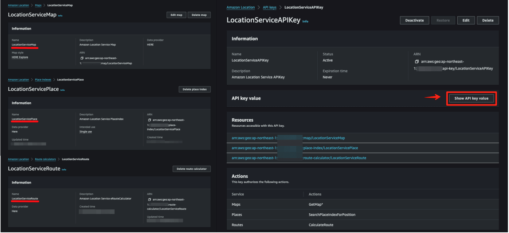
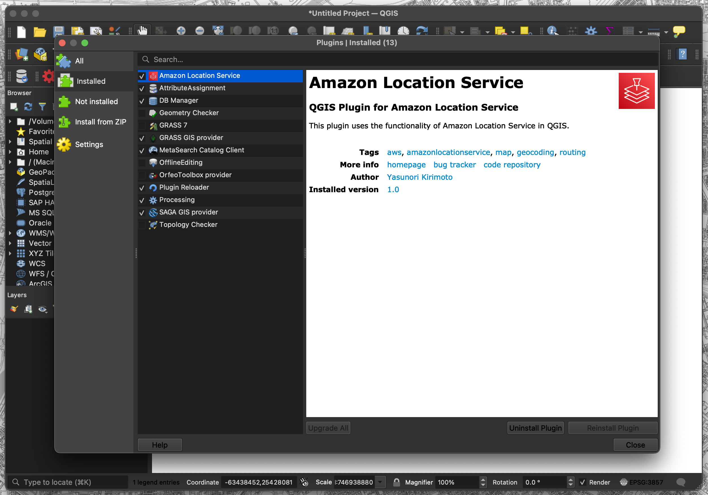
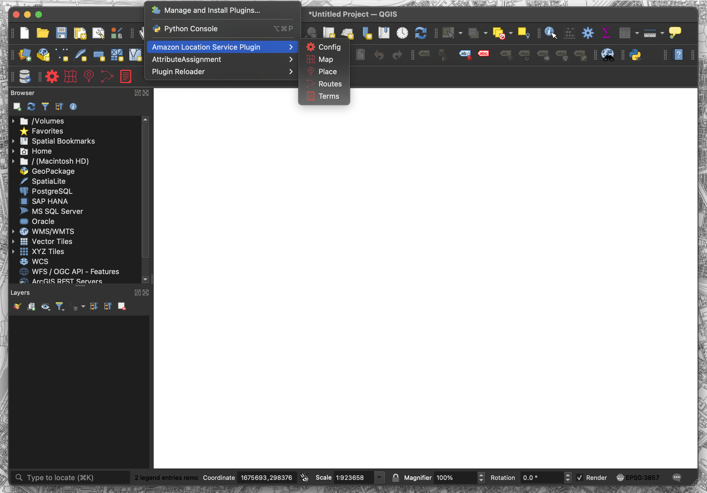
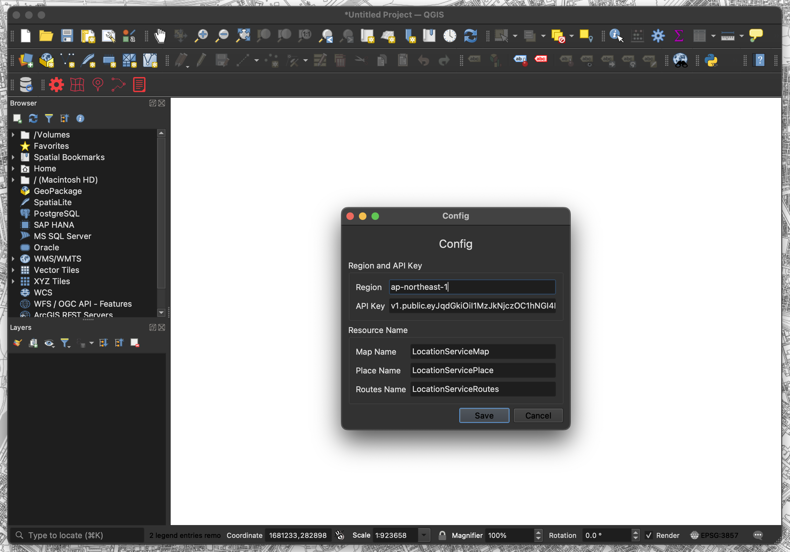
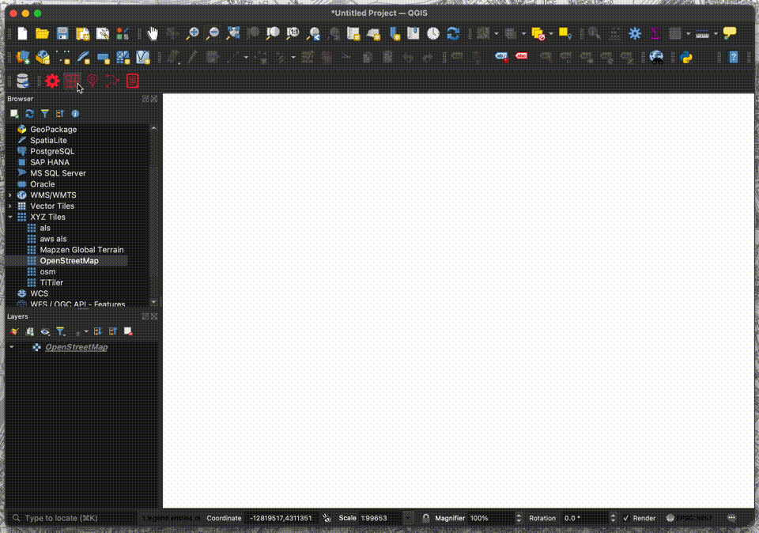
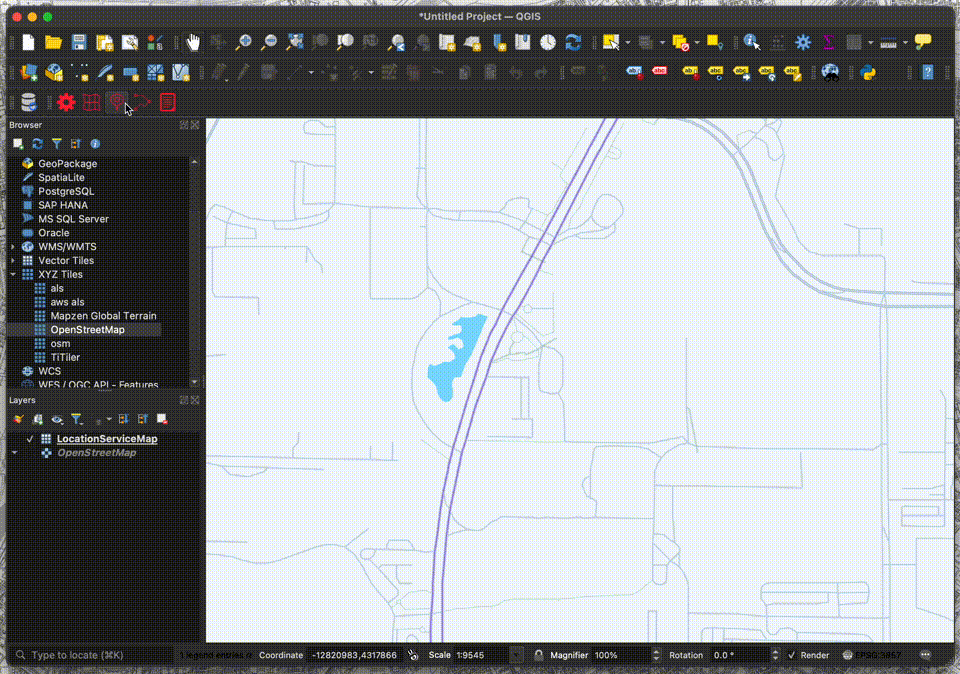
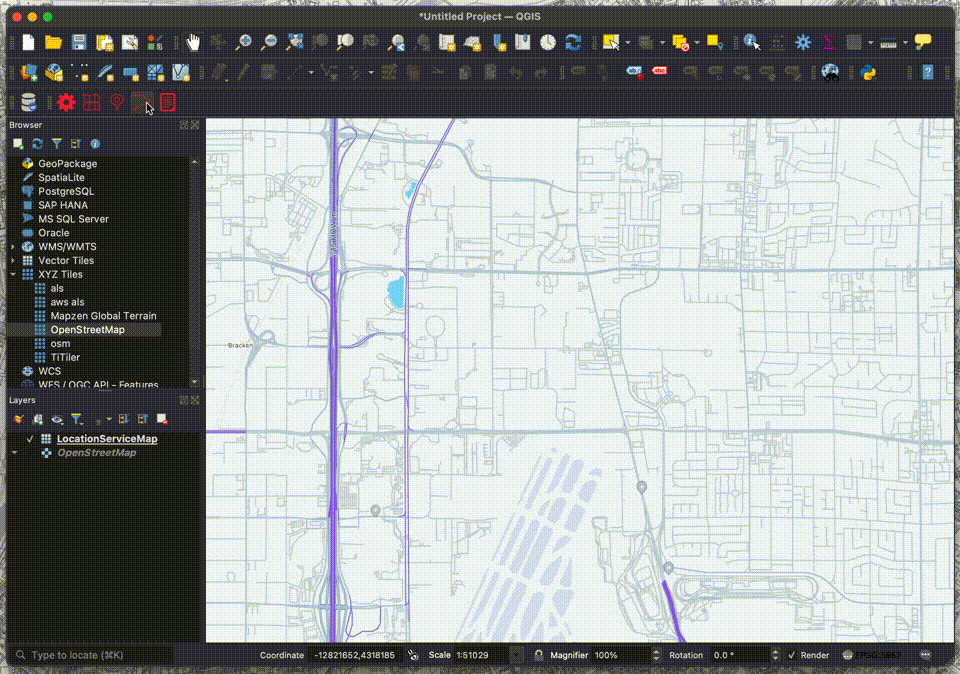

# Amazon Location Service Plugin

他の言語で読む: [英語](./README.md)

QGISでAmazon Location Serviceの機能を利用するプラグインです。  

- [QGIS](https://qgis.org)  
- [Amazon Location Service](https://aws.amazon.com/location)  

## QGIS Python Plugins Repository

[Amazon Location Service Plugin](https://plugins.qgis.org/plugins/location_service)  

## blog

[QGIS版Amazon Location Service PluginをOSSで公開](https://zenn.dev/mierune/articles/try-110-qgis-amazonlocationservice-plugin)  

## 利用方法

### Amazon Location Serviceのリソース構築

下記から選択しリソース構築

- AWS Management Console
- AWS CDK
- AWS CloudFormation

[AWS CDKとAWS CloudFormationでAmazon Location Serviceのリソースを構築する](https://aws.amazon.com/jp/builders-flash/202404/build-amazon-location-service/)  
[dayjournal memo - Amazon Location Service](https://memo.dayjournal.dev/tags/amazon-location-service/)  

### QGIS Pluginのインストール

1. 「プラグイン」→「プラグインを管理およびインストール」を選択
2. 「Amazon Location Service」で検索

プラグインは[zipファイル](https://github.com/dayjournal/qgis-amazonlocationservice-plugin/releases)を読み込みでもインストール可能

### メニュー

- Config: 各リソース名とAPIキーを設定
- Map: 地図表示機能
- Place: ジオコーディング機能
- Routes: ルーティング機能
- Terms: 利用規約ページを表示

### 設定

1. 「Config」メニューをクリック
2. 各リソース名とAPIキーを設定
    - Region: ap-xxxxx
    - API Key: v1.public.xxxxx
    - Map Name: Mapxxxxx
    - Place Name: Placexxxxx
    - Routes Name: Routesxxxxx
3. 「Save」をクリック

### Map機能

1. 「Map」メニューをクリック
2. 「Map Name」を選択
3. 「Add」をクリック
4. 背景地図がレイヤで表示

※ 2024.05現在、1スタイル表示可能

### Place機能

1. 「Place」メニューをクリック
2. 「Select Function」を選択
3. 「Get Location」をクリック
4. 検索したい位置をクリック
5. 「Search」をクリック
6. 検索結果がレイヤで表示

※ 2024.05現在、SearchPlaceIndexForPositionが利用可能

### Routes機能

1. 「Routes」メニューをクリック
2. 「Select Function」を選択
3. 「Get Location(Starting Point)」をクリック
4. 始点をクリック
5. 「Get Location(End Point)」をクリック
6. 終点をクリック
7. 「Search」をクリック
8. 検索結果がレイヤで表示

※ 2024.05現在、CalculateRouteが利用可能

### Terms機能

1. 「Terms」メニューをクリック
2. 利用規約ページがブラウザで表示

### 利用規約

[AWS Service Terms](https://aws.amazon.com/jp/service-terms)

Amazon Location Serviceにはデータ利用について利用規約があります。「82. Amazon Location Serviceプレビュー」の項目を確認し、自己責任でご利用ください。開発者は、本サービスの利用に関して発生するいかなる損害についても一切の責任を負いません。  

HEREをプロバイダとして使用する場合、基本的な利用規約に加えて、次のことを行うことはできません。  

a. ジオコード化および逆ジオコード化の結果を含む日本のロケーションデータを保管またはキャッシュすること。  
b. 別の第三者プロバイダからのマップの上にHEREのルートを重ねること、またはHEREのマップ上に他の第三者プロバイダからのルートを重ねること。  

## ライセンス

Python modules are released under the GNU General Public License v2.0

Copyright (c) 2024 Yasunori Kirimoto
