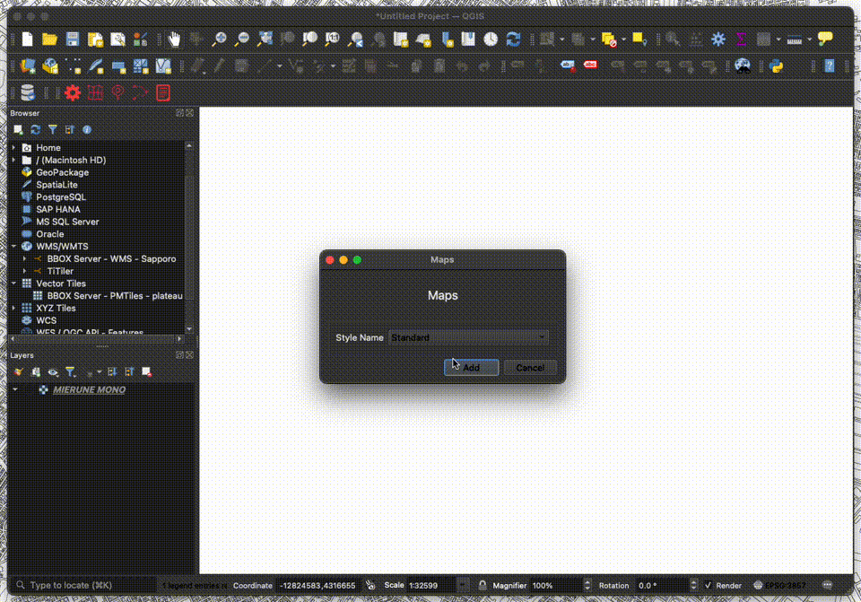
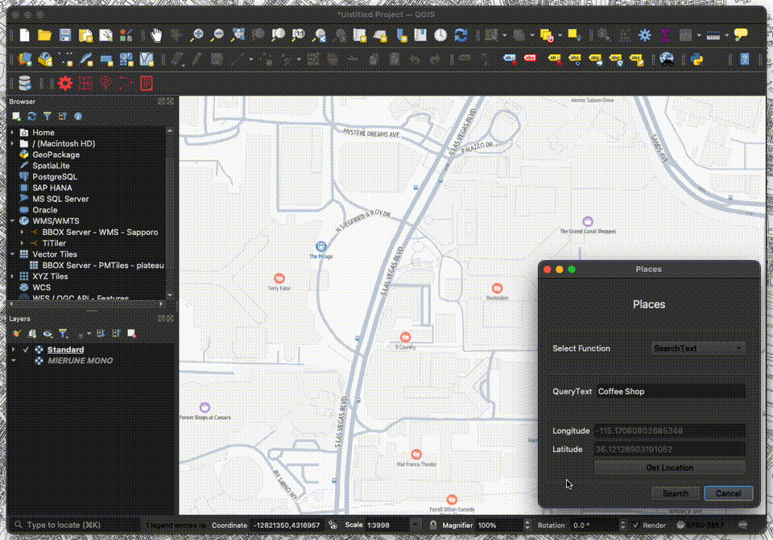

# Amazon Location Service Plugin

他の言語で読む: [英語](./README.md)

QGISでAmazon Location Service v2の機能を利用するプラグインです。  

- [QGIS](https://qgis.org)  
- [Amazon Location Service](https://aws.amazon.com/location)  

## QGIS Python Plugins Repository

[Amazon Location Service Plugin](https://plugins.qgis.org/plugins/location_service)  

## blog

## 利用方法

### Amazon Location ServiceのAPIキー作成

[Amazon Location Service v2のAPIキー作成](https://memo.dayjournal.dev/memo/amazon-location-service-007)  

### QGIS Pluginのインストール

1. 「プラグイン」→「プラグインを管理およびインストール」を選択
2. 「Amazon Location Service」で検索

プラグインは[zipファイル](https://github.com/dayjournal/qgis-amazonlocationservice-plugin/releases)を読み込みでもインストール可能

### メニュー

- Config: リージョン名とAPIキーを設定
- Maps: 地図表示機能
- Places: ジオコーディング機能
- Routes: ルーティング機能
- Terms: 利用規約ページを表示

### 設定

1. 「Config」メニューをクリック
2. リージョン名とAPIキーを設定
    - Region: ap-xxxxx
    - API Key: v1.public.xxxxx
3. 「Save」をクリック

### Maps機能

1. 「Maps」メニューをクリック
2. 「Map Name」を選択
3. 「Add」をクリック
4. 背景地図がレイヤで表示

### Places機能

1. 「Places」メニューをクリック
2. 「Select Function」を選択
3. 「QueryText」にテキスト入力
4. 「Get Location」をクリック
5. 検索したい位置をクリック
6. 「Search」をクリック
7. 検索結果がレイヤで表示

※ 2025.01現在、SearchTextが利用可能

### Routes機能

1. 「Routes」メニューをクリック
2. 「Select Function」を選択
3. 「Get Location(Starting Point)」をクリック
4. 始点をクリック
5. 「Get Location(End Point)」をクリック
6. 終点をクリック
7. 「Search」をクリック
8. 検索結果がレイヤで表示

※ 2025.01現在、CalculateRoutesが利用可能

### Terms機能

1. 「Terms」メニューをクリック
2. 利用規約ページがブラウザで表示

### 利用規約

[AWS Service Terms](https://aws.amazon.com/jp/service-terms)

Amazon Location Serviceにはデータ利用について利用規約があります。「82. Amazon Location Serviceプレビュー」の項目を確認し、自己責任でご利用ください。開発者は、本サービスの利用に関して発生するいかなる損害についても一切の責任を負いません。  

HEREをプロバイダとして使用する場合、基本的な利用規約に加えて、次のことを行うことはできません。  

a. ジオコード化および逆ジオコード化の結果を含む日本のロケーションデータを保管またはキャッシュすること。  
b. 別の第三者プロバイダからのマップの上にHEREのルートを重ねること、またはHEREのマップ上に他の第三者プロバイダからのルートを重ねること。  

## ライセンス

Python modules are released under the GNU General Public License v2.0

Copyright (c) 2024-2025 Yasunori Kirimoto
